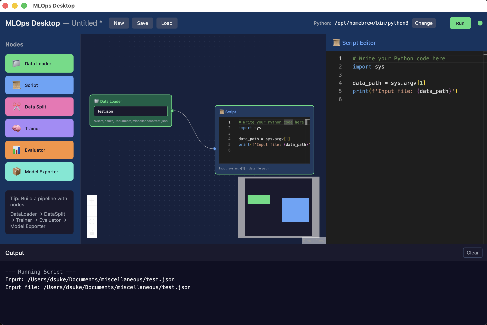
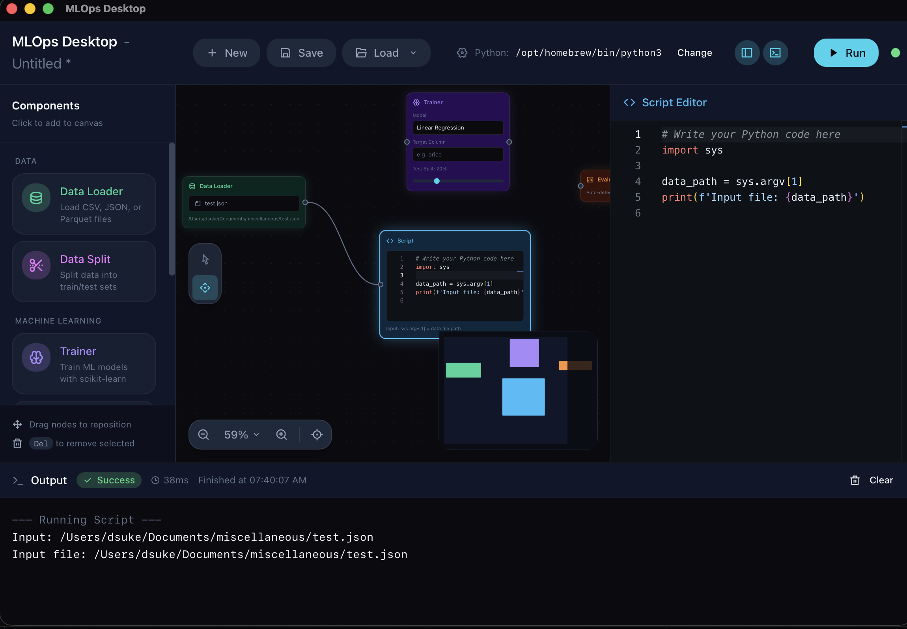
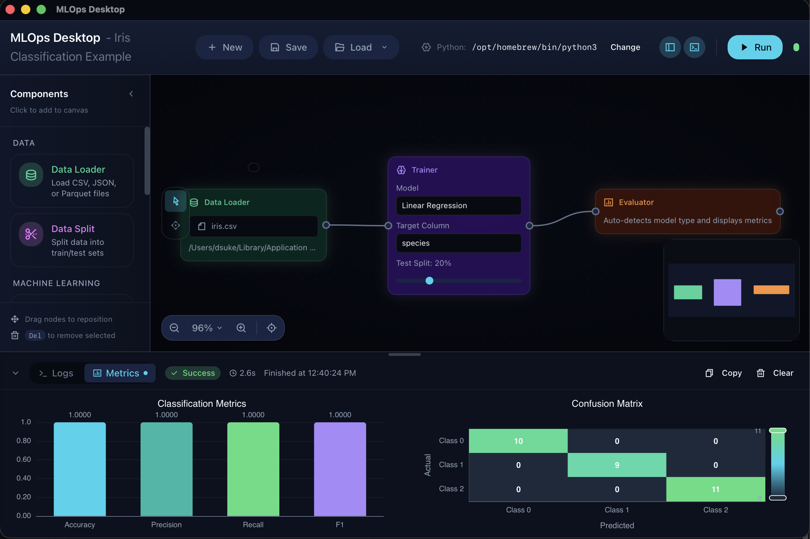

# MLOps Desktop

Visual ML pipeline builder for macOS. Train, evaluate, and deploy models without writing boilerplate code.



## Features

- **Visual Pipeline Builder** - Drag-and-drop canvas with ReactFlow
- **Node Types** - DataLoader, DataSplit, Trainer, Evaluator, ModelExporter, Script
- **ML Models** - Linear Regression, Random Forest, Gradient Boosting, XGBoost, LightGBM
- **Hyperparameter Tuning** - Optuna integration with Grid/Random/TPE search
- **Model Explainability** - Feature importance, SHAP values, partial dependence plots
- **Experiment Tracking** - Run history, metrics comparison, annotations
- **Model Registry** - Version management, staging (None → Staging → Production)
- **Model Serving** - HTTP inference server with FastAPI/uvicorn
- **Pipeline Templates** - Pre-built templates for common ML tasks

## Requirements

- macOS 12+ (Apple Silicon or Intel)
- Python 3.9+ (system Python)

## Quick Start (Development)

```bash
git clone https://github.com/babushkai/desktop.git
cd desktop
npm install
npm run tauri dev
```

Then:
1. Create new pipeline or load a template (⌘T)
2. Add DataLoader → Trainer → Evaluator nodes
3. Connect nodes and configure parameters
4. Click Run (⌘R)

## Screenshots





## Development

### Prerequisites

- Node.js 18+
- Rust 1.70+
- npm

### Commands

```bash
npm run dev          # Vite dev server only
npm run tauri dev    # Full Tauri development
npm run build        # Production build
npm run test         # Run tests
```

## Tech Stack

- **Frontend**: React 19, TypeScript, Vite, Zustand, @xyflow/react
- **Backend**: Rust, Tauri 2.0, SQLite
- **UI**: Tailwind CSS, Headless UI, Remix Icons
- **Charts**: ECharts

## Documentation

- [API Reference](./docs/API.md) - Tauri command documentation

## License

MIT
